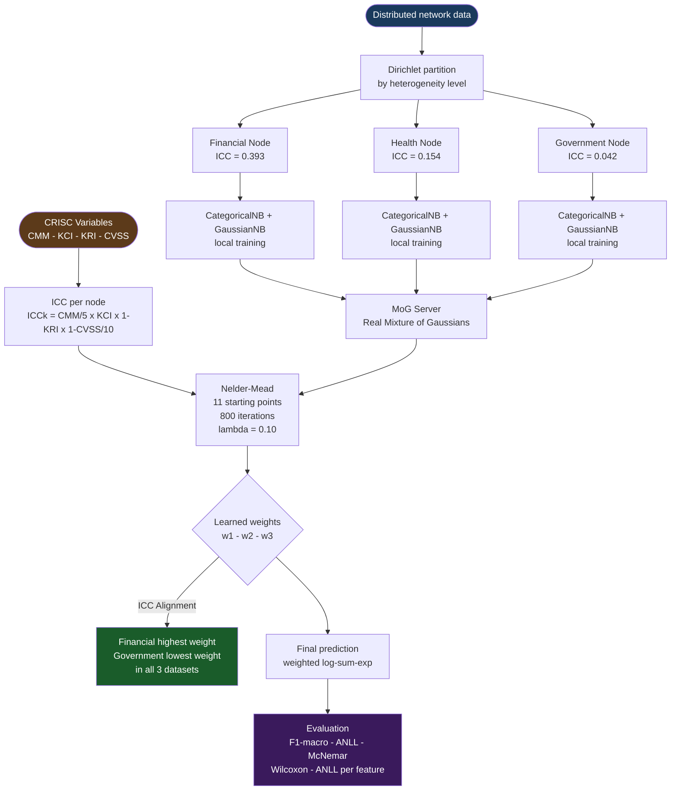

# Federated Naive Bayes with Real Mixture of Gaussians and Institutional Governance Regularization for Network Intrusion Detection

**EJD-UMA-FedNB-GRC v2.4**  
Edgar Oswaldo Herrera-Logroño  
Doctoral Researcher, Universidad de Málaga, Spain  
Senior Information Security Analyst, DNSIPD-IESS, Ecuador  
ORCID: [0009-0000-3968-7397](https://orcid.org/0009-0000-3968-7397)

Preprint: [arXiv:2605.18647](https://arxiv.org/abs/2605.18647)  
Submitted to: Journal of Network and Computer Applications (Elsevier)

---

## Central idea

Federated learning for intrusion detection rests on a flawed premise: that every participating institution contributes equally to the shared model. In practice, a financial institution with mature security controls and low vulnerability exposure produces fundamentally different data than a government agency operating with weaker controls and higher exposure. Treating their local models as equivalent discards information that organisations already collect through standard risk management audits.

This work converts that audit knowledge into a mathematical signal inside the federated optimizer. Four governance indicators from the CRISC framework of ISACA (CMM, KCI, KRI, CVSS) are combined into an Institutional Coherence Index (ICC) that acts as a regularization prior in Nelder-Mead. The optimizer learns node weights from validation data, guided by that prior, without any explicit ordering constraint imposed.

The central finding, termed **ICC Alignment**, is that in all three datasets evaluated, the node with the highest institutional maturity received the highest learned weight and the node with the lowest maturity received the lowest. That pattern emerged from the data, not from a forced constraint.

---

## Process diagram



---

## Results (10 repetitions per configuration, seed 42)

| Dataset | Year | Records | A - ICC-CRISC | B - FedAvg | D - FedProx | ΔA-B | McNemar sig |
|---|---|---|---|---|---|---|---|
| NSL-KDD | 2009 | 147,888 | 0.9035 | 0.8939 | 0.8941 | +0.0096 | 4/7 alphas |
| CIC-IDS2017 | 2017 | 100,000 | 0.7389 | 0.6686 | 0.6686 | +0.0703 | 5/7 alphas |
| UNSW-NB15 | 2015 | 257,673 | 0.2391 | 0.2303 | 0.2302 | +0.0088 | 5/7 alphas |
| **Combined avg.** | | | **0.6272** | **0.5976** | **0.5976** | **+0.0296** | **137/157 (87%)** |

The largest margin occurs on CIC-IDS2017, where class imbalance under Dirichlet partitioning favors proposal A. On NSL-KDD and UNSW-NB15 the advantage is narrower but consistent across all heterogeneity levels.

**Additional statistical significance:**  
The Wilcoxon signed-rank test confirmed significance (p < 0.05) in 7 of 16 alpha-dataset combinations evaluated. The mean Cliff's Delta was 0.548, corresponding to a medium-to-large effect size.

**ICC Alignment:**  
In all three datasets, the Financial node (ICC = 0.393) received the highest learned weight and the Government node (ICC = 0.042) the lowest, without any explicit ordering constraint in the objective function. This pattern held across datasets collected in different years by different research groups on different continents.

**Density estimation:**  
Proposal A estimated the probability density better than baseline B in 66.7% of the numerical features evaluated on the validation set, pooled across all three datasets.

---

## CRISC governance variables per institutional node

| Node | CMM | KCI | KRI | CVSS | ICC |
|---|---|---|---|---|---|
| Financial | 4 | 0.82 | 0.12 | 3.2 | 0.393 |
| Health | 3 | 0.70 | 0.25 | 5.1 | 0.154 |
| Government | 2 | 0.55 | 0.40 | 6.8 | 0.042 |

ICC_k = (CMM/5) × KCI × (1 − KRI) × (1 − CVSS/10)

---

## Experimental parameters

| Parameter | Value |
|---|---|
| Repetitions | 10 per configuration |
| Dirichlet alphas | 0.05 / 0.10 / 0.20 / 0.30 / 0.50 / 0.70 / 1.00 |
| Random seed | 42 |
| Split | Train 60% / Val 20% / Test 20% |
| Optimizer | Nelder-Mead, 11 starting points, 800 iterations |
| Validation samples for optimization | 3,000 |
| Regularizer | L2, lambda = 0.10 |
| Minimum weight floor per node | 0.05 |

---

## Datasets

All three datasets are publicly available:

- **NSL-KDD (2009):** https://www.unb.ca/cic/datasets/nsl.html
- **CIC-IDS2017 (2017):** https://www.unb.ca/cic/datasets/ids-2017.html
- **UNSW-NB15 (2015):** https://research.unsw.edu.au/projects/unsw-nb15-dataset

---

## How to run

The notebook is organized in labeled sections. Execution order:

CELDA1 (Google Drive) → CELDA2 (Kaggle) → KEEPALIVE → SEC0 → SEC1 → SEC2 → SEC3 → SEC4 → SEC5 → SEC6 → SEC7 → SEC8DEF → SEC8EXEC → SEC9 → STRESS → RESUMEN → CONCLUSIONES

Results are saved to Google Drive after each dataset completes. If the Colab session is interrupted, checkpoints preserve already computed data.

---

## Cite this work

```bibtex
@misc{herrera2026federated,
  title   = {Federated Naive Bayes with Real Mixture of Gaussians
             and Institutional Governance Regularization
             for Network Intrusion Detection},
  author  = {Herrera-Logro\~{n}o, Edgar Oswaldo and
             L\'{o}pez-Rubio, Ezequiel and
             Ortiz-de-Lazcano-Lobato, Juan Miguel},
  year    = {2026},
  note    = {arXiv:2605.18647. Submitted to Journal of Network
             and Computer Applications, Elsevier.}
}
```
