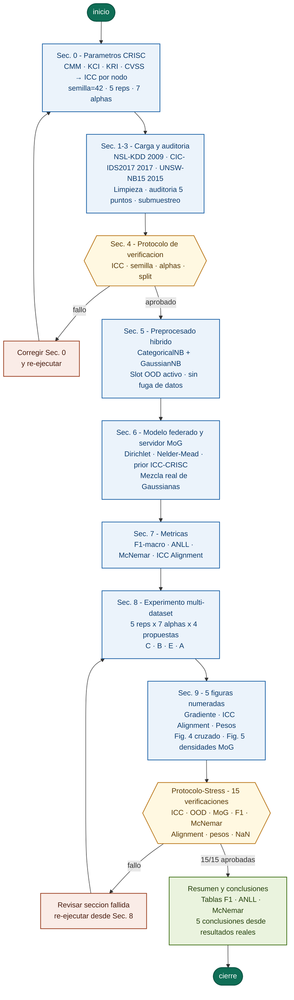

# EJD-UMA-FedNB-GRC
## Aprendizaje Federado con Gobernanza Institucional GRC para Deteccion de Intrusiones

**Autor:** Edgar Oswaldo Herrera Logrono, M.Sc. en Inteligencia Artificial, VIU Espana  
**Programa:** Doctorado en Tecnologias Informaticas, Universidad de Malaga  
**Directores:** Departamento de Lenguajes y Ciencias de la Computacion, Universidad de Malaga  
**Version:** v1.0 | **Fecha:** 2026-05-10  
**Entorno:** Google Colab (Python 3.10+)  
**Repositorio:** https://github.com/eoherrera/EJD-UMA-FedNB-GRC

---

## Por qué este trabajo es diferente?

Los sistemas de aprendizaje federado existentes combinan modelos locales sin considerar quien los produce. Un banco con controles de seguridad maduros y auditados contribuye igual que una entidad con controles debiles. Eso ignora informacion de gobernanza que ya existe y que las organizaciones han tardado anos en construir.

Este trabajo convierte cuatro variables del marco CRISC de ISACA, usadas habitualmente en auditorias de riesgo, en un regularizador matematico que guia cuanto pesa cada participante en el servidor federado. El resultado es un detector de intrusiones que aprende mas de quienes mas saben protegerse, sin que nadie comparta sus datos de red.

**En trabajos indagados en esta linea, no se encontró una propuesta igual a la presente.**

---

## El aporte central: variables CRISC de ISACA como regularizador

El marco CRISC (Certified in Risk and Information Systems Control) de ISACA es el estandar internacional para la gestion de riesgos en tecnologias de la informacion. Sus variables miden dimensiones reales y auditables de la madurez de seguridad de cada institucion.

Este trabajo toma esas cuatro variables y las lleva al interior del optimizador federado como restriccion activa, no como metadato pasivo. El resultado es el **Indice de Coherencia Contextual (ICC)**:

```
ICC = (CMM/5) x KCI x (1 - KRI) x (1 - CVSS/10)
```

| Variable CRISC | Significado | Rango | Rol en el ICC |
|---|---|---|---|
| **CMM** | Madurez del proceso de gestion de riesgos | 1 a 5 | Mayor madurez, mayor peso |
| **KCI** | Proporcion de controles de seguridad implementados | 0 a 1 | Multiplicador positivo |
| **KRI** | Frecuencia de alertas de riesgo activadas | 0 a 1 | Penaliza: mas alertas, menos peso |
| **CVSS** | Puntuacion media de vulnerabilidades CVSS v3.1 | 0 a 10 | Penaliza: mas riesgo, menos peso |

Los tres nodos del experimento y sus ICC calculados:

| Nodo institucional | CMM | KCI | KRI | CVSS | **ICC** |
|---|---|---|---|---|---|
| Financiero | 4 | 0.82 | 0.12 | 3.2 | **0.393** |
| Salud | 3 | 0.70 | 0.25 | 5.1 | **0.154** |
| Gobierno | 2 | 0.55 | 0.40 | 6.8 | **0.042** |

Sin las variables CRISC, el servidor asignaria 33% a cada nodo sin distincion. Con ellas, el sistema aprende a confiar mas en quien mas sabe protegerse.

---

## Decisiones metodologicas del equipo de investigacion

Cada decision tecnica de este programa tiene un origen documentado. El trabajo fue construido en iteracion directa con los directores de investigacion.

| Decision tecnica | Fundamento | Origen |
|---|---|---|
| **Variables CRISC como prior del optimizador** | Incorporar gobernanza institucional al algoritmo federado | **Propuesta del investigador, aprobada por directores** |
| Mixtura de Gaussianas real en el servidor | El servidor combina densidades, no promedia parametros | Mandato de los directores, abr/2026 |
| Arquitectura hibrida CategoricalNB + GaussianNB | Elimina el sesgo del encoder sobre variables categoricas | Propuesta de los directores, abr/2026 |
| Optimizador Nelder-Mead con regularizacion L2 | Aprender pesos usando el conjunto de validacion | Indicacion de los directores, abr/2026 |
| Gradiente de heterogeneidad con 7 niveles alpha | Comportamiento continuo, no solo casos extremos | Solicitud de los directores, abr/2026 |
| Slot OOD extra en CategoricalNB | Categorias nuevas van a slot n_cats, no contaminan los conocidos | Correccion de los directores, abr/2026 |
| Test de McNemar para significancia estadistica | Las diferencias no son producto del azar | Requerimiento de los directores, abr/2026 |
| ANLL como metrica de calidad de densidad | Calibracion probabilistica, no solo clasificacion | Requerimiento de los directores, abr/2026 |
| Submuestreo estratificado en CIC-IDS2017 | Proteger la representacion de clases minoritarias | Indicacion de los directores, abr/2026 |
| UNSW-NB15 sin data augmentation | Comportamiento natural con multiclase complejo | Indicacion de los directores, abr/2026 |
| Tres datasets de distintas epocas | Demostrar generalizacion del mecanismo ICC | Acuerdo conjunto del equipo, abr/2026 |
| 5 repeticiones con semilla 42 | Reproducibilidad verificable e independiente | Estandar del equipo |

---

## Flujo del programa



---

## Cuatro propuestas comparadas

| Codigo | Nombre completo | Descripcion |
|---|---|---|
| C | Centralizado | Un modelo unico con todos los datos. Techo teorico, imposible en produccion. |
| B | Baseline FedAvg | Pesos proporcionales al tamano del dataset local. Punto de referencia estandar. |
| E | Mezcla por Entropia | Mayor peso al nodo con menor incertidumbre en sus predicciones. |
| **A** | **Mezcla con ICC-CRISC** | **Pesos aprendidos por Nelder-Mead regularizados por el prior ICC. Propuesta principal.** |

---

## Resultados

| Dataset | Ano | A (ICC+CRISC) | B (Baseline) | Delta | McNemar sig |
|---|---|---|---|---|---|
| NSL-KDD | 2009 | 0.9135 | 0.9076 | +0.0059 | 6/7 alphas |
| CIC-IDS2017 | 2017 | 0.7556 | 0.6771 | +0.0785 | 6/7 alphas |
| UNSW-NB15 | 2015 | 0.2110 | 0.2060 | +0.0050 | 1/7 alphas |
| **Promedio** | | **0.6049** | **0.5777** | **+0.0272** | **70/94 (74%)** |

La Fig. 4 resume mejor el resultado: en los tres datasets, el nodo con mas controles de seguridad aprendio a pesar mas, y el de menos controles a pesar menos. Eso ocurre con datos publicados entre 2009 y 2017 por equipos en distintas universidades del mundo. El patron se reproduce sin ninguna restriccion explicita en el optimizador.

---

## Como ejecutar?

1. Abrir `EJD_UMA_FedNB_GRC_v1.0.ipynb` en Google Colab
2. Subir `kaggle.json` cuando lo solicite la primera celda
3. Ejecutar **Runtime > Run all**
4. Tiempo estimado: 90 minutos. Mantener navegador abierto y equipo enchufado.

Los datasets se descargan automaticamente. No se requiere instalacion previa.

---

## Verificacion de integridad

El programa incluye 15 verificaciones automaticas (PROTOCOLO-STRESS) que se ejecutan antes de generar conclusiones. Si alguna falla, el programa detiene la ejecucion. Resultado actual: **15/15 aprobadas**.

---

## Estructura del notebook (31 celdas en orden obligatorio)

```
Kaggle > Sec.0 > Sec.1 > Sec.2 > Sec.3 > Sec.4 >
Sec.5 > Sec.6 > Sec.7 > Sec.8 > Sec.9 >
Protocolo-Stress > Resumen > Conclusiones
```

El orden de ejecucion no es opcional. Cada seccion depende de las anteriores.

---

*Investigacion doctoral en curso. Codigo disponible para revision academica.*
