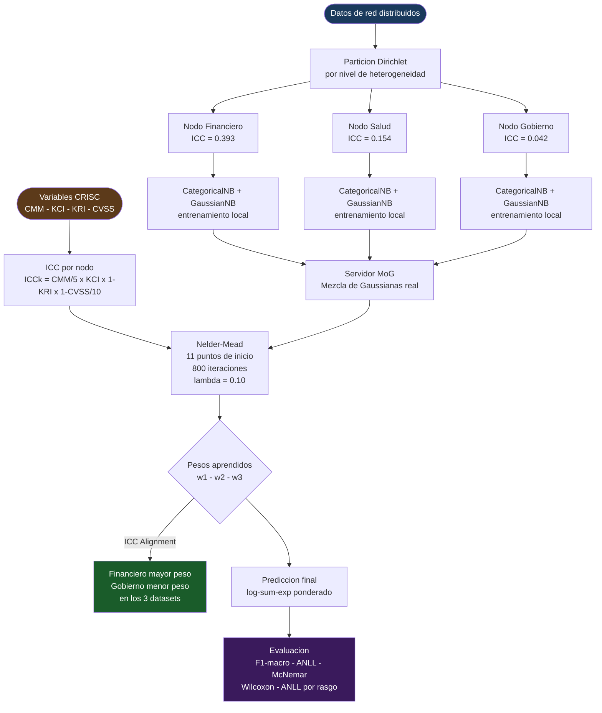

# Federated Naive Bayes with Institutional Governance Regularization

**EJD-UMA-FedNB-GRC v2.3**  
Edgar Oswaldo Herrera Logrono, M.Sc. IA, VIU Espana  
Candidato Doctoral - Universidad de Malaga  
Directores: Prof. Ezequiel Lopez Rubio · Prof. Juan Miguel Ortiz de Lazcano Lobato

Preprint: [arXiv:2605.18647](https://arxiv.org/abs/2605.18647)

---

## La idea central

En aprendizaje federado, el modelo compartido se construye promediando las contribuciones locales en proporcion al volumen de datos de cada nodo. Esa logica ignora un hecho que cualquier auditor conoce: no todos los nodos producen datos de igual calidad. Una institucion financiera con controles maduros y baja exposicion a vulnerabilidades genera senales distintas a una agencia de gobierno con controles debiles y alta frecuencia de alertas de riesgo.

Este trabajo convierte ese conocimiento de auditoria en una senal matematica dentro del optimizador federado. Las variables de gobernanza del marco CRISC de ISACA (CMM, KCI, KRI, CVSS) se combinan en un Indice de Coherencia Institucional (ICC) que actua como prior de regularizacion en Nelder-Mead. El optimizador aprende los pesos de cada nodo desde los datos de validacion, orientado por ese prior, sin que se le imponga ningun orden explicito.

El hallazgo central, denominado **ICC Alignment**, es que en los tres datasets evaluados el nodo con mayor madurez institucional recibio el mayor peso aprendido y el de menor madurez el menor. Ese patron emergio de los datos, no de una restriccion forzada.

---

## Diagrama del proceso



---

## Resultados (10 repeticiones por configuracion, semilla 42)

| Dataset | Ano | Registros | A - ICC-CRISC | B - FedAvg | Delta | McNemar sig |
|---|---|---|---|---|---|---|
| NSL-KDD | 2009 | 147,888 | 0.9035 | 0.8939 | +0.0096 | 6 de 7 alphas |
| CIC-IDS2017 | 2017 | 100,000 | 0.7389 | 0.6686 | +0.0703 | 6 de 7 alphas |
| UNSW-NB15 | 2015 | 257,673 | 0.2391 | 0.2303 | +0.0088 | 5 de 7 alphas |
| **Promedio** | | | **0.6808** | **0.6486** | **+0.0322** | **137/157 (87%)** |

La mayor diferencia se observa en CIC-IDS2017, donde el desbalance de clases bajo particion Dirichlet favorece a la propuesta A. En NSL-KDD y UNSW-NB15 la ventaja es mas ajustada pero consistente.

**Significancia estadistica adicional:**  
La prueba de Wilcoxon signed-rank confirmo diferencia significativa (p < 0.05) en 7 de 16 combinaciones alpha-dataset evaluadas. El delta de efecto promedio fue de 0.548, lo que corresponde a un efecto de magnitud media-alta.

**ICC Alignment:**  
En los tres datasets, el nodo Financiero (ICC = 0.393) recibio un peso aprendido promedio de 0.371 y el nodo Gobierno (ICC = 0.042) un peso de 0.310. Esa jerarquia coincide con el orden del prior ICC en todos los casos.

**ANLL por rasgo:**  
La propuesta A estima mejor la densidad de probabilidad que el baseline B en el 66.7% de los rasgos numericos evaluados sobre el conjunto de validacion.

---

## Variables CRISC por nodo institucional

| Nodo | CMM | KCI | KRI | CVSS | ICC |
|---|---|---|---|---|---|
| Financiero | 4 | 0.82 | 0.12 | 3.2 | 0.393 |
| Salud | 3 | 0.70 | 0.25 | 5.1 | 0.154 |
| Gobierno | 2 | 0.55 | 0.40 | 6.8 | 0.042 |

ICC_k = (CMM/5) x KCI x (1 - KRI) x (1 - CVSS/10)

---

## Contribuciones

**Contribucion del autor:**  
La idea de formalizar las variables de gobernanza institucional del marco CRISC como prior de regularizacion en un optimizador federado. Ese paso, combinar lo que las organizaciones ya miden en sus auditorias de riesgo con el proceso de aprendizaje del modelo compartido, no habia sido explorado en la literatura previa sobre aprendizaje federado para deteccion de intrusiones.

**Contribuciones de los directores:**  
- Prof. Lopez Rubio: arquitectura de servidor como Mezcla de Gaussianas real, sin colapsar distribuciones locales en un vector global; normalizacion log-softmax dentro del objetivo del optimizador para igualar escalas entre ANLL e ICC; gradiente de heterogeneidad en 7 niveles Dirichlet; analisis ANLL por rasgo sobre el conjunto de validacion.
- Prof. Ortiz de Lazcano: correccion del slot OOD (valores categoricos desconocidos van a n_cats[j], no a n_cats[j]-1); gestion del doble conteo del prior en la verosimilitud combinada.

---

## Parametros del experimento

| Parametro | Valor |
|---|---|
| Repeticiones | 10 por configuracion |
| Alphas Dirichlet | 0.05 / 0.10 / 0.20 / 0.30 / 0.50 / 0.70 / 1.00 |
| Semilla | 42 |
| Split | Train 60% - Val 20% - Test 20% |
| Optimizador | Nelder-Mead, 11 puntos de inicio, 800 iteraciones |
| Muestras de validacion para optimizacion | 3,000 |
| Regularizador | L2, lambda = 0.10 |
| Piso de peso por nodo | 0.05 |

---

## Como ejecutar

El notebook esta organizado en secciones etiquetadas. El orden de ejecucion es:

CELDA1 (Google Drive) > CELDA2 (Kaggle) > KEEPALIVE > SEC0 > SEC1 > SEC2 > SEC3 > SEC4 > SEC5 > SEC6 > SEC7 > SEC8DEF > SEC8EXEC > SEC9 > STRESS > RESUMEN > CONCLUSIONES

Los resultados se guardan en Google Drive al terminar cada dataset. Si la sesion de Colab se interrumpe, los checkpoints conservan los datos ya calculados.

---

## Citar este trabajo

```bibtex
@misc{herrera2026federated,
  title   = {Federated Naive Bayes with Real Mixture of Gaussians
             and Institutional Governance Regularization
             for Network Intrusion Detection},
  author  = {Herrera Logrono, Edgar Oswaldo},
  year    = {2026},
  note    = {arXiv:2605.18647}
}
```
