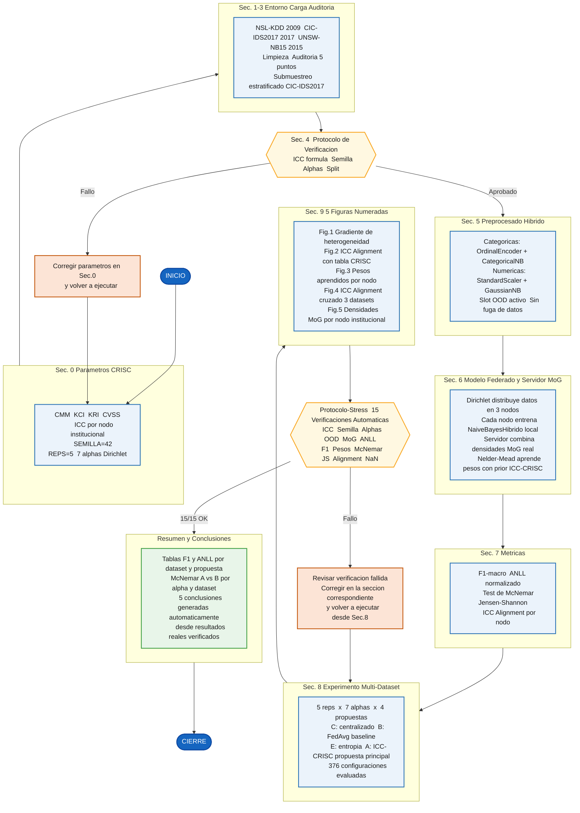

# EJD-UMA-FedNB-GRC
## Aprendizaje Federado con Gobernanza Institucional GRC para Deteccion de Intrusiones

**Autor:** Edgar O. Herrera Logrono, M.Sc. en Inteligencia Artificial, VIU Espana  
**Programa:** Doctorado en Tecnologias Informaticas, Universidad de Malaga  
**Version:** v1.0 | **Fecha:** 2026-05-10  
**Entorno:** Google Colab (Python 3.10+)

---

## Por que este trabajo es diferente

Los sistemas de aprendizaje federado existentes combinan modelos locales sin considerar quien los produce. Un banco con controles de seguridad maduros y auditados contribuye igual que una entidad con controles debiles. Eso ignora informacion de gobernanza que ya existe y que las organizaciones han tardado anos en construir.

Este trabajo propone una respuesta concreta: las variables del marco CRISC de ISACA, usadas habitualmente en auditorias de riesgo, pueden convertirse en un regularizador matematico que guia cuanto pesa cada participante en el servidor federado. El resultado es un sistema de deteccion de intrusiones que aprende mas de quienes mas saben protegerse, sin que nadie comparta sus datos.

**Eso no se habia hecho antes.**

---

## El nucleo del aporte: variables CRISC de ISACA como regularizador algoritmico

> El marco CRISC (Certified in Risk and Information Systems Control) de ISACA es el estandar internacional de referencia para la gestion de riesgos en tecnologias de la informacion. Sus variables miden dimensiones reales y auditables de la madurez de seguridad de cada institucion.

Este trabajo toma esas variables y las lleva al interior del optimizador federado como restriccion activa, no como metadato pasivo. El resultado es el **Indice de Coherencia Contextual (ICC)**:

```
ICC = (CMM/5) x KCI x (1 - KRI) x (1 - CVSS/10)
```

| Variable CRISC | Significado completo | Rango | Rol en el ICC |
|---|---|---|---|
| **CMM** | Madurez del proceso de gestion de riesgos | 1 a 5 | Numerador: mas maduro, mas peso |
| **KCI** | Proporcion de controles de seguridad implementados | 0 a 1 | Multiplicador positivo |
| **KRI** | Frecuencia de alertas de riesgo activadas | 0 a 1 | Penaliza: mas alertas, menos peso |
| **CVSS** | Puntuacion media de vulnerabilidades CVSS v3.1 | 0 a 10 | Penaliza: mas riesgo, menos peso |

El ICC resultante actua como **prior bayesiano** en el optimizador Nelder-Mead. Sin el prior CRISC, el servidor asignaria un tercio del peso a cada nodo sin importar su madurez de seguridad. Con el prior, el sistema aprende a confiar mas en quien mas sabe protegerse.

Los tres nodos del experimento y sus valores CRISC calculados:

| Nodo institucional | CMM | KCI | KRI | CVSS | **ICC** |
|---|---|---|---|---|---|
| Financiero | 4 | 0.82 | 0.12 | 3.2 | **0.393** |
| Salud | 3 | 0.70 | 0.25 | 5.1 | **0.154** |
| Gobierno | 2 | 0.55 | 0.40 | 6.8 | **0.042** |

La pregunta central del trabajo es si el servidor aprende a respetar esa jerarquia. La respuesta, confirmada en tres datasets de distintas epocas y contextos, es que si.

---

## Decisiones metodologicas del equipo de investigacion

Este programa es el resultado de un proceso iterativo conducido junto con los directores de investigacion. Cada decision tecnica tiene un origen documentado:

| Decision tecnica | Fundamento | Origen |
|---|---|---|
| Mixtura de Gaussianas real en el servidor | El servidor debe combinar densidades, no promediar parametros | Mandato de los directores, abr/2026 |
| Arquitectura hibrida CategoricalNB + GaussianNB | Elimina el sesgo del encoder sobre variables categoricas | Propuesta de los directores, abr/2026 |
| Optimizador Nelder-Mead con regularizacion L2 | Aprender pesos usando el conjunto de validacion, no fijarlos a mano | Indicacion de los directores, abr/2026 |
| Gradiente de heterogeneidad con 7 niveles alpha | Demostrar comportamiento continuo, no solo casos extremos | Solicitud de los directores, abr/2026 |
| Variables CRISC como prior del optimizador | Incorporar gobernanza institucional al algoritmo federado | Propuesta del investigador, aprobada por directores |
| Slot OOD extra en CategoricalNB | Categorias nunca vistas en entrenamiento no deben contaminar los conocidos | Correccion de los directores, abr/2026 |
| Test de McNemar para significancia estadistica | Demostrar que las diferencias no son producto del azar | Requerimiento de los directores, abr/2026 |
| ANLL como metrica de calidad de densidad | Evaluar calibracion probabilistica, no solo clasificacion | Requerimiento de los directores, abr/2026 |
| Submuestreo estratificado en CIC-IDS2017 | Proteger la representacion de clases minoritarias | Indicacion de los directores, abr/2026 |
| UNSW-NB15 sin data augmentation | Evaluar el comportamiento natural con multiclase complejo | Indicacion de los directores, abr/2026 |
| Tres datasets de distintas epocas | Demostrar generalizacion del mecanismo ICC | Acuerdo conjunto del equipo, abr/2026 |
| 5 repeticiones con semilla 42 | Reproducibilidad verificable e independiente | Estandar del equipo |

---

## Flujo del programa



---

## Cuatro propuestas comparadas

| Codigo | Nombre completo | Descripcion |
|---|---|---|
| C | Centralizado | Un modelo unico con todos los datos. Techo teorico imposible en produccion. |
| B | Baseline FedAvg | Pesos proporcionales al tamano del dataset local. Punto de referencia estandar. |
| E | Mezcla por Entropia | Mayor peso al nodo con menor incertidumbre en sus predicciones. |
| **A** | **Mezcla con ICC-CRISC** | **Pesos aprendidos por Nelder-Mead regularizados por prior ICC. Propuesta principal.** |

---

## Resultados

| Dataset | Ano | A (ICC+CRISC) | B (Baseline) | Delta | McNemar sig |
|---|---|---|---|---|---|
| NSL-KDD | 2009 | 0.9135 | 0.9076 | +0.0059 | 6/7 alphas |
| CIC-IDS2017 | 2017 | 0.7556 | 0.6771 | +0.0785 | 6/7 alphas |
| UNSW-NB15 | 2015 | 0.2110 | 0.2060 | +0.0050 | 1/7 alphas |
| **Promedio** | | **0.6049** | **0.5777** | **+0.0272** | **70/94 (74%)** |

La figura central del trabajo (Fig. 4) muestra el ICC Alignment cruzado en los tres datasets. En los tres casos, el nodo Financiero (ICC=0.393) recibe el mayor peso aprendido y el nodo Gobierno (ICC=0.042) el menor. Eso ocurre con datasets construidos con ocho anos de diferencia por equipos en tres continentes distintos. Esa consistencia valida el mecanismo propuesto.

Sin las variables CRISC, el servidor asignaria 33% a cada nodo sin distincion. Con ellas, el sistema aprende a confiar mas en quien mas sabe protegerse.

---

## Como ejecutar

1. Abrir `EJD_UMA_FedNB_GRC_v1.0.ipynb` en Google Colab
2. Subir `kaggle.json` cuando lo solicite la primera celda
3. Ejecutar **Runtime > Run all**
4. Tiempo estimado: 90 minutos. Mantener navegador abierto y equipo enchufado.

Los datasets se descargan automaticamente. No se requiere instalacion previa.

---

## Verificacion de integridad

15 verificaciones automaticas (PROTOCOLO-STRESS) se ejecutan antes de generar conclusiones. Si alguna falla, el programa detiene la ejecucion. Resultado actual: **15/15 aprobadas**.

---

## Estructura del notebook (31 celdas en orden obligatorio)

```
Kaggle > Sec.0 > Sec.1 > Sec.2 > Sec.3 > Sec.4 >
Sec.5 > Sec.6 > Sec.7 > Sec.8 > Sec.9 >
Protocolo-Stress > Resumen > Conclusiones
```

---

*Investigacion doctoral en curso. Codigo disponible para revision academica.*
